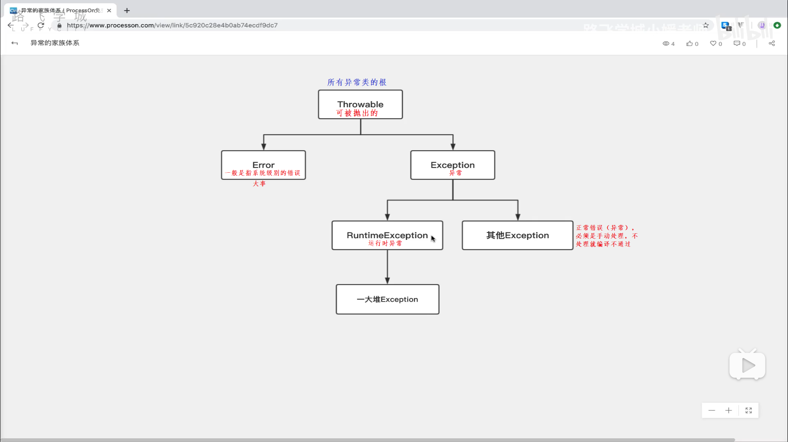

---

---

# 1、异常处理简介

---

> 
>
> 三百六十行，行行出异常
>
> 


#### 异常就是错误对象

- **编译时异常 ：大概是语法错误**
- **运行时异常 ：大概时语义错误**

#### 抛异常

- **创建一个错误对象，把错误对象丢出来**

#### 捕获异常

-  **JVM 捕获被扔出来的抛异常，并打印出来**
-  **JVM会终止程序的执行。所以后续不能让 JVM 来进行捕获异常**


---

---

# 2、异常的分类

---


1. **RuntimeException ：运行时异常（一般程序员很少去手动处理，因为太多。出问题后才会去处理）——  好多的小石子**
2. **其他Exception ： 必须要手动处理，不然编译不通过  ——  大石头**
3. **Error ： 一般指的是系统级错误 ，一般普通程序员搞不定，一般不处理 —— 山塌了 **


#### 异常家族体系




---

---

# 3、 异常处理 —— try ……catch

---


### 语法：

```java
try{
	尝试执行的代码 ;
} catch( Exception e ) {  // 变量 Exception e —— 用来捕获抛出来的异常（抛异常）
    处理异常的代码 ; 
} finally {
    最终的代码 ; 
}
```

```java
package 异常处理;

public class Test {
    public static void main(String[] args) {
        try{
            System.out.println(1/0);  //0不能做除数
            //System.out.println(1/1);
        } catch(Exception e){
            e.printStackTrace();    //打印错误信息
            System.out.println("系统出错了，请联系管理员"); //一般是给客户看的
        } finally{  //一般做收尾工作
            System.out.println("你好，我是finally");
        }

    }
}

```


---

---

# 4、异常处理 —— throws和throw

---


### throws : 表示方法准备向外扔出异常 

```java
package 异常处理_throws和throw;

import java.io.File;
import java.io.FileInputStream;
import java.io.InputStream;

public class Test {
    public static void read() throws Exception{  //表示这个方法会抛出去Exception这样的错误，产生的任何问题都扔出去

            InputStream is = new FileInputStream(new File("hahahaha"));  //读取文件要准备的流

    }

    public static void main(String[] args) throws Exception {
        //或者
//        try {
//            read();
//        } catch (Exception e) {
//            e.printStackTrace();
//        }

        read();
    }
}

```

### throw ：表示向外抛出异常

```java
package 异常处理_throws和throw;

import java.io.File;
import java.io.FileInputStream;
import java.io.InputStream;

public class Test {

    public static void chu(int a, int b) throws Exception{  //告诉外面我要扔出错误
        if (b==0){
            throw new Exception("你不可以给我一个0");   //这是真正的向外抛出异常
        } else {
            System.out.println(a/b);
        }
    }

    public static void main(String[] args){
        try {
            chu(2,1);  // IDEA 里 alt+enter选择处理异常的方式
        } catch (Exception e) {
            e.printStackTrace();
        }
    }
}

```


###### 产生的错误尽量自己处理，少向外抛出异常


---

---

# 5、自定义异常

---


###### 直接继承 Exception 或者是RuntimeException 来实现自定义异常

```java
package 自定义异常;

public class Person {
    String name;
    String gender;

    public Person(String name, String gender){
        this.name = name;
        this.gender = gender;
    }
}

-------------------------------------------------------------------------------------------------------------------
    
package 自定义异常;

public class Bathhouse {

    public void man(Person p) throws GenderException{
        if(p.gender.equals("男")){
            System.out.println("洗个痛快澡");
        } else {    //来了个女的
            //需要抛出异常
            throw new GenderException("你进错了，这里是男澡堂子。");
        }
    }
}

-------------------------------------------------------------------------------------------------------------------
    
package 自定义异常;

public class GenderException extends Exception{
    //自己定义的异常必须要继承 Exception（必须处理） 或者是 RuntimeException（看心情处理）

    public GenderException(String m){
        super(m);//调用父类的构造方法。Exception(m)
    }

}

-------------------------------------------------------------------------------------------------------------------
    
package 自定义异常;

public class Main {

    public static void main(String[] args) throws GenderException{
        Person p1 = new Person("张无忌", "男");

        Person p2 = new Person("赵敏", "女");

        Bathhouse bh = new Bathhouse();

        bh.man(p1);
    }

}

```

