# 1、面向对象和面向过程

---


### 面向对象和面向过程的区别

> 面向过程：侧重的是过程
>
> ​				优点: 简单
>
> ​				缺点： 代码量打了之后，维护性相当的差劲，维护成本越高
>
> 面向对象：侧重的是对象，是上帝视角
>
> ​				优点： 可拓展性非常强，维护成本低
>
> ​				缺点： 对新手不友好，上手难度高


---

---

# 2、面向对象概述

---


### 	重点知识点

> 1、类与对象
>
> 2、构造方法
>
> 3、访问权限
>
> 4、继承
>
> 5、多态【最重要】
>
> 6、抽象和接口
>
> 7、内存分析


---

---

# 3、类与对象

---

###### 对象就是目标

**造车：**

1. 画图纸
   1. 定义车的属性信息：color、speed、seat
   2. 定义车的动作：跑
2. 拿着图纸去车厂造车

**面向对象的世界里**：

- 类：类就是图纸
  1. 属性：这一类事物拥有的共同属性
  2. 动作：这一类事物共同能执行的功能
- 对象：使用类创建的某一类具体事物

#### 对象能干什么？完全取决与类是如何定义的

---

#### 		写代码

1. 类要使用class来定义

   ```java
   class Car {
   	//成员变量
   	String color; //车的颜色
   	int speed; //车的速度
   	int seat = 5; //车的座位数
   	
       //成员方法   
   	public void run() {
   		System.out.println("这是一辆跑车	");
   	}	
   	
       public static void main(String[] args){
       	int a = 10; //写在main方法里的变量——局部变量
       	
       	//创建对象
       	Car c = new Car(); //创建了一辆车，后面需要使用这辆车就需要用定义的类名(这里是c)来访问
           //与我们平时创建的变量相似，比如：int a = 10;
       	/*
       		在面向对象的世界里，变量是没有市场的。这种变量被称为引用。
       		Java被分为两种数据类型：1、基本数据类型 2、引用数据类型：String和我们创建的所有类
    		*/
   
               //让车去跑
            c.run();//调用对象：必须用 对象.方法(); 或 引用.方法;
               // . 表述调用
            c.color = "red";  //车的颜色
            c.speed = 120;	   //车的速度
            c.seat;	//车的座位数
            //c.pailiang = 1.5;  类中没有定义的内容不能进行调用，因为不存在    
            System.out.println("车的颜色是："+c.color+ " 车的速度是："+c.speed+ " 车的座位数是"+c.seat);
           
           Car c2 = new Car();
           c2.color = "pink";
           c2.speed = 110;
           c2.seat;
           System.out.println("车的颜色是："+c2.color+ " 车的速度是："+c2.speed+ " 车的座位数是"+c2.seat);
       }
   }
   ```
   
2. 属性：成员变量来描述。直接写在类中的变量。

3. 动作：成员方法。不写static就是成员方法

4. 创建对象：

   - 类 引用 = new 类();


---

---
#  4、this关键字
---


### 	this 表示当前类的对象

```java
class Car{
    int speed;
    int seat;
    String color;
    
    public void run() {
        //默认会有一个this：当前正在执行这个方法的对象
        //获取车的颜色和速度
        System.out.println(this.color);
        System.out.println(this.speed);
        System.out.println("车能跑");
    }
    
    public static void main(String[] args) {
        Car c = new Car(); //车中的属性就是类中定义好的成员变量
        
        c.color = "red";
        c.speed = 120;
        c.seat = 5;;
        
        c.run(); //在调用方法的时候，Java会自动的把对象传递给方法。在方法中，由this关键字接受
    }
} 
```

### 	this还可以帮我们区分成员变量和局部变量

```java
class Car{
    int speed;
    int seat;
    String color;
    
    public void run() {
        System.out.println(this.color);
        System.out.println(this.speed);
        System.out.println("车能跑");
    }
    public void fly(String color){
        System.out.println(this.color+"的车会飞，飞在"+color+"的颜色的云彩里");
        
        //System.out.println(color+"的车会飞");  //此时访问的也是成员变量
        //变量的查找顺序：现在自己的方法体里找，如果自己的方法体中没有则就去this里面找
    }
    public static void main(String[] args) {
        Car c = new Car();
        c.color = "粉红色";
        
        c.fly("white");
    }
} 
```

### 	this还可以在方法内部获取到对象中的属性信息

### this还可以调用当前类中的其他构造方法


---

---
# 5、构造方法

---


```java
public class Car{
    String color;
    int speed;
    int seat=5;
    
    //Java会自动的赠送给每一个类一个无参的构造方法
	    //在创建对象的时候，自动调用方法
		//public Car(){}
	//如果你自己定义了一个构造方法，Java就不会自动给你一个无参的构造方法
    public Car(String color, int speed){
        //设置属性信息
		this.color = color;
		this.speed = speed;
		//System.out.println("你好，我是构造方法");
    }
    
    public void run(){
        System.out.println(this.color+"颜色的车在跑");
    }
    public static void main(String[] args) {
        Car c1 = new Car("红色", 120); //默认调用的是构造方法
//        c1.color = "pink";
//        c1.speed = 120;
        
        Car c2 = new Car("蓝色", 180);
//        c2.color = "blue";
//        c2.speed = 270;
        
        c1.run();
        c2.run();
    }
}
```

#### 	在创建对象的时候，自动调用的方法

- 语法

  ```java
  public 类名(传入的参数){
      
  }
  ```

- 注意：

  > 1、没有返回值这一项
  >
  > 2、在我们new的时候，会自动调用构造方法 —— new 类();
  >
  > 【注意】：Java会自动给每一个类一个无参的构造方法，但是如果你写了构造方法，Java就不会给类分配构造方法

####    作用：在创建对象时，给对象设置属性信息


---

---

# 6、构造方法的重载

---


```java
class DaXia {
    String name;
    String nickname;
    int age;
    String Faction;
    
    //鉴于创建的两位人物一人有外号，另一人没有；所以需要创建两个构造方法（一个有外号，一个没外号）
    public DaXia(String name, int age, String Faction){
		this.name = name;
        this.age = age;
		this.Faction = Faction;
	}
	//构造方法也是方法所以也可以重载
	//这使得我们可以有更多的方式可以创建对象
    public DaXia(String name, int age, String Faction, String nickname){

		this(name, age, Faction); //this的另一个功能：还可以调用当前类中的其他构造方法
		this.nickname = nickname;
    }

    
    public static void main(String[] args) {
        
        DaXia  yuebuqun = new DaXia("岳不群", 18, "华山");
        DaXia wusong = new DaXia("武松", 29, "行者", "水浒");            
    }
}
```

### 总结

> 构造方法也是方法，也可以进行重载
>
> 作用：可以更多的方式进行创建对象
>
> 使用  this 可以访问其他的构造方法 —— this()


---

---

# 7、面向对象练习_1

---


 ### 	1、用面向对象的思维来模拟LOL里盖伦上阵杀敌

```java
class Hero{
    String name;
    String skill_q;
    String skill_w;
    String skill_e;
    String skill_r;

    public Hero(String name) {
        this.name = name;
    }

    public Hero(String name, String skill_q, String skill_w, String skill_e, String skill_r) {
        this(name);  //调用当前类中其他的构造方法
        this.skill_q = skill_q;
        this.skill_w = skill_w;
        this.skill_e = skill_e;
        this.skill_r = skill_r;
    }

    public void kill() {
        System.out.println(this.name+"上阵杀敌");
    }

    public static void main(String[] args) {
        Hero h = new Hero("盖伦", "小宝剑", "防御", "龙卷风", "大宝剑");
        h.kill();
    }
}
```


### 	2、用面向对象的思维来完成植物大战僵尸

> - 创建植物

```java
package 植物大战僵尸;

public class Plant {
    String name;
    int hp;
    int attack;

    public Plant(String name, int hp, int attack) {
        this.name = name;
        this.hp = hp;
        this.attack = attack;
    }

    //植物打僵尸
    public void fight(Zombie z) {
        System.out.println(this.name+"在打"+z.name);
        //僵尸掉血
        z.hp -= this.attack;
        System.out.println("僵尸的血量剩余"+z.hp);
    }
}
```

> - 创建僵尸

```java
package 植物大战僵尸;

public class Zombie {
    String name;
    int hp;
    int attack;

    public Zombie(String name, int hp, int attack) {
        this.name = name;
        this.hp = hp;
        this.attack = attack;
    }

    public void eat(Plant p) {
        System.out.println(this.name+"正在吃"+p.name+"植物");
        p.hp -= this.attack;
        System.out.println("植物的血量剩余：" + p.hp);
    }
}
```

> - 函数调用

```java
package 植物大战僵尸;

public class 草地 {
    public static void main(String[] args) {
        //创建植物和僵尸
        Plant p = new Plant("豌豆", 1000, 10);
        Zombie z = new Zombie("橄榄运动员僵尸", 800, 20);

        p.fight(z);
        z.eat(p);
    }
}
```


#### 总结

**不是所有代码都要写在同一个类里**


---

---

# 8、static关键字

---

> static 静态

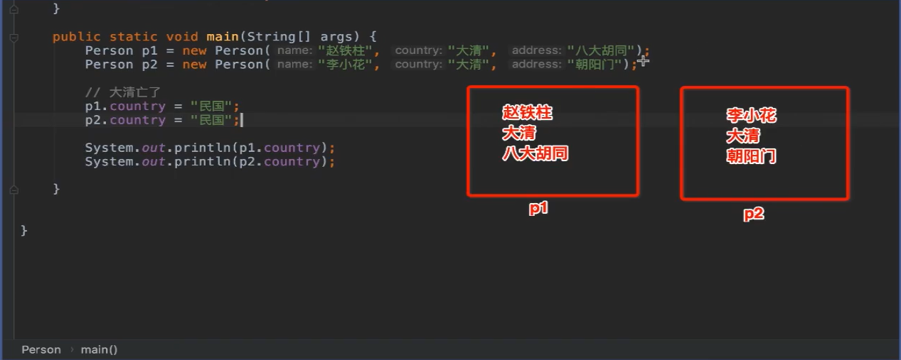

​	

| 上图这张图有多少人就意味着要修改多少次 |
| -------------------------------------- |
|                                        |

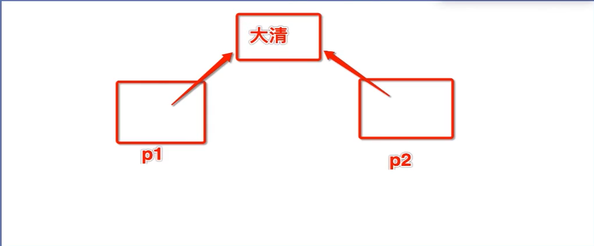

| 静态的内容在内存中是只保留一份的，并且各个对象之间进行共享 |
| ---------------------------------------------------------- |
|                                                            |

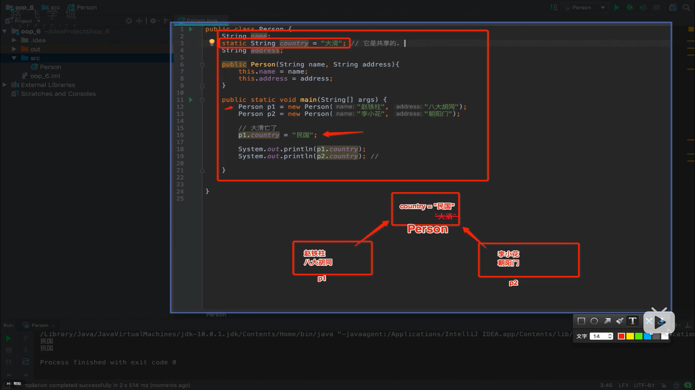

| 使用 p1.country = “民国”，不推荐这样使用静态变量 |
| ------------------------------------------------ |
| **我们推荐使用类名去访问静态内容**               |
|                                                  |

```java
public class Person {
    String name;
    String address;
    static String country = "大清";   // static修饰后的是共享的

    public Person(String name, String address){
        this.name = name;
        this.address = address;
    }

    public static void main(String[] args) {
        Person p1 = new Person("张三", "八大胡同");
        Person p2 = new Person("李四", "朝阳门");

        //改朝换代 —— 大清亡了
        //p1.country = "民国"; static 修饰后只需修改一个人的，其余的也会跟着一起改变
        //p2.country = "民国";  推荐使用类名去访问静态内容
        Person.country = "民国";
        System.out.println(p1.country);
        System.out.println(p2.country);
    }
}
```

> **特点：**
>
> ​	**1、会数据共享**
>
> ​	**2、不属于对象，属于类**
>
> ​	**3、静态东西是优先于对象产生的**

#### 	通用构造器和静态构造器

```java
public class 通用构造器和静态构造器{
    {
        System.out.println("这里是通用构造器");
    }
    static {
        System.out.println("这里是静态构造器");
    }

    public 通用构造器和静态构造器(){
        System.out.println("构造方法");
    }

    String name;
    public static void chi(){
        //System.out.println(this.name);  不允许这样写，因为静态内容优先于对象产生
    }
    
    public static void main(String[] args){
        new 通用构造器和静态构造器();
    }
}

/*
	运行结果：
			这里是静态构造器
			这里是通用构造器
			构造方法

*/
```

```java
public calss Test(){
    public static void eat(){
        System.out.println("吃东西");
    }

    public static void main(String[] args) {
        eat();//在静态方法里可以调用静态内容
        Test.eat();  //使用类名去访问静态方法
    }
}
```


#### 	创建对象的过程（简单版）

>    1、静态构造器
> 	       2、通用构造器
>     	   3、构造方法 -> 创建对象用的

.png)

##### 	因为创建对象的过程是子啊静态内容加载完毕之后，在静态方法和静态块里不能使用 this

> 总结：
>
> ​		1、静态内容优先于对象产生，并且不属于对象
>
> ​		2、静态内容使用类名去访问


---

---

# 9、包和导包

---


```java
package com.google.www;		//包的声明，表示当前类从属于www这个包下(就是文件的路径)


import com.microsoftstore.office.Person;	//把office下的Person类导入到当前文件
import com.microsoftstore.office.*;		//*表示导入office包下的所有类（尽量用哪个就导哪个）
public class Test{
    public static void main(String[] args) {
        Person p = new Person();
    }
}
```

#### 	包和导包

> 包实质上就是文件夹
>
> 在代码中需要哦写package包名 ; 
>
> ​	导包 —— import 包  类 ;

### 	不需要进行导包

> 1. ​	在自己包下面
>
> 2. 在Java.lang包下的所有内容都不需要导包
>
>    ​			比如：String、System.out.println()


---

---

# 10、访问权限

---


### 四种访问权限（其三）

- public 公共的、公开的。所有人都可以进行访问
- default  包访问权限。在自己包内可以随意访问  String name
- private 私有的，只能自己使用  


----

---

# 11、getter和setter

---


```java
package com.google.www;

public class Person {
    //成员变量是私有的，就不能被外界访问
    private String name;
    private String gender;
    private int age;

    /*	setter	*/
    public void setName(String name){
        this.name = name;
    }
    public void setAge(int age) {
        //是方法就可以进行判断
        //有效的保护成员变量，不被恶意赋值
        if (age < 0) {
            this.age = 0;
        } else {
            this.age = age;
        }
    }
    /*	getter	*/
    public String getName(){ 
        return this.name;
    }
    public int getAge(){
        return this.age;
    }
    public String getGender(){
        return this.gender;
    }

    public void setGender(String gender){
        this.gender = gender;
    }
    public void eat(){
        System.out.println("吃东西");
    }
}


-------------------------------------------------------------------------------------------------


package com.google.www;

public class TestPerson {
    public static void main(String[] args) {
        Person p =new Person();
//        p.name = "张三";
//        p.gender = "male";
//        p.age = -1;  //语法是没有问题，但是逻辑上有漏洞

        p.setName("张三");
        p.setGender("Male");
        p.setAge(10);

        System.out.println("这个人的名字是："+p.getName()+" 性别是："+p.getGender()+" 年龄是"+p.getAge());
        System.out.print("张三在");p.eat();
    }
}

```

### 总结 

> 成员变量一般使用 private 来声明，保护成员变量不被恶意修改
>
> ​		setter：主要是给成员变量赋值，做一定的保护
>
> ​		getter： 从成员变量中获取数据
>
>   
>
> 【利用 IDE可以自动生成 getter和 setter】


---

---

# 12、继承

---


> **子类可以自动拥有父类除私有类内容以外的所有内容** 
>
> 当出现 x 是一种 y 的时候， x就可以继承 y

##### 								黑熊精是妖怪，因此黑熊怪就可以继承妖怪

> public class 类 extends 父类{
>
> }

```java
package 继承;
public class 妖怪 {
    String name;
    public void eat(){
        System.out.println("想吃唐僧肉");
    }
    private void 怕死(){
        System.out.println("妖怪怕死");
    }
}

-------------------------------------------------------------------------------------------------
    
package 继承;

public class 黑熊精 extends 妖怪 {
    public void Steal(){
        System.out.println("黑熊怪偷袈裟");   //子类对父类进行的扩展
    }

}

-------------------------------------------------------------------------------------------------
    
package 继承;

public class Main {
    public static void main(String[] args) {
        黑熊精 黑熊怪 = new 黑熊精();
        System.out.print("黑熊精");黑熊怪.eat();
        //黑熊精.怕是(); 私有内容是不能被继承的
        黑熊怪.name = "大黑熊";
        System.out.println("黑熊怪的名字是:"+黑熊怪.name);
        黑熊怪.Steal();
    }
}

```


#### 作用

> 子类可以对父类进行扩展
>
> 简化代码开发
>
> 

```java
package Login;

//普通用户
public class Member extends User{
    
}

-------------------------------------------------------------------------------------------------
    
package Login;

//管理员
public class Admin extends User {
    
}

-------------------------------------------------------------------------------------------------
    
package Login;

public class User {
    public void login(){
        System.out.println("登录");
    }
}

-------------------------------------------------------------------------------------------------
    
package Login;

public class Main {
    public static void main(String[] args) {
        Member member = new Member();
        member.login();

        Admin admin = new Admin();
        admin.login();
    }
}
```


---

---

# 13、super 关键字

---


> super ： 表示父类里的内容
>
> this : 表示自己类中的内容
>
> **可以用 super 和 this 来区分父类与子类中重名的内容**

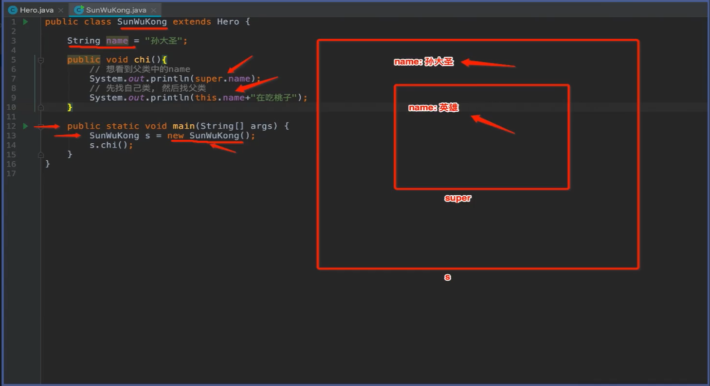

| 创建对象的过程：先创建父类对象，然后再创建子类对象        |
| --------------------------------------------------------- |
| 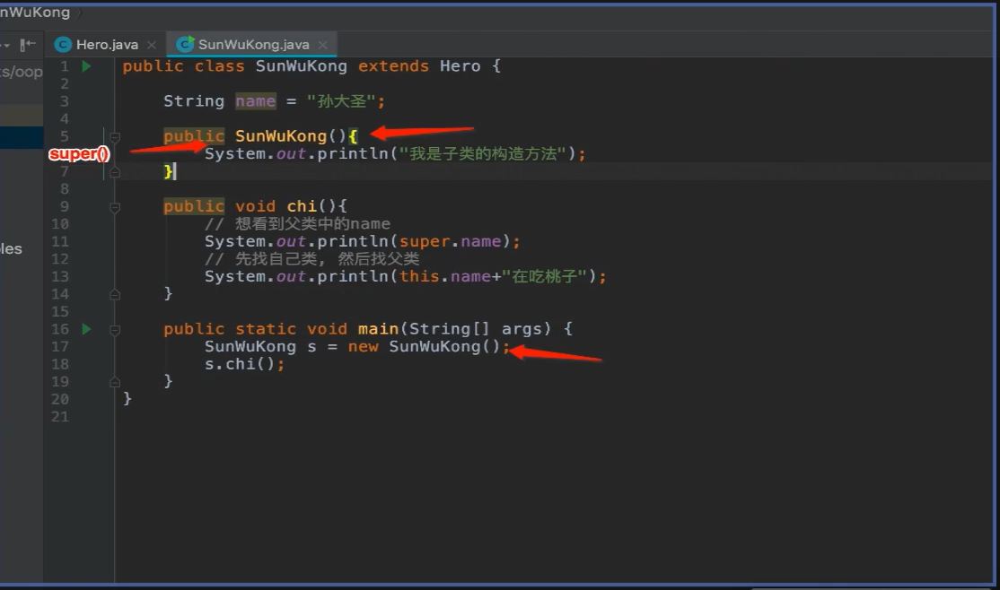 |

```java
package Super关键字;

public class Hero {
    String name = "英雄";

    public Hero(){
        System.out.println("我是父类的构造方法");
    }
}

-------------------------------------------------------------------------------------------------

package Super关键字;

import com.sun.source.doctree.SummaryTree;
import org.w3c.dom.ls.LSOutput;

public class SunWuKong extends Hero{

    String name = "泼猴";

    public SunWuKong(){
       // super(); //程序还原。在子类构造方法的第一行会默认调用父类的构造方法，并且对super的调用必须是构造器中的第一个语句
        System.out.println("我是子类的构造方法");
    }

    public void eat(){
        System.out.println(this.name+"在偷吃蟠桃");
                //this.name —— 变量查找顺序：先在自己类里查找，找不到再去父类里找（就近原则）
        //想看到父类里的name
        System.out.println(super.name+"在吃蟠桃");
    }

    public static void main(String[] args) {
        SunWuKong swk = new SunWuKong();
        swk.eat();
    }
}
```

### 小总结

1. super可以获取父类中的内容

2. super可以调用父类中的构造方法，并且调用时必须写在子类构造的第一行。如果父类的构造是无参数的可以不写，如果父类 没有参数的构造，必须要写 —— super(参数)；

    

   

---

---

# 14、方法的重写

---


### 重写：子类对父类中提供方法的重新定义

```java
package chongxie;

public class 李渊 {
    public void buildCountry(){
        System.out.println("李渊想建立唐朝");
    }
}

----------------------------------------------------------------------------------------------------------------------------------------------

package chongxie;

public class 李世民 extends 李渊{

    //重写： 子类中的方法必须和父类中的方法完全一致
    public void buildCountry(){
        //半盖
        super.buildCountry(); //super可以调用父类中被重写的方法

        System.out.println("李世民也想建立一个自己的国家");
    }

    public static void main(String[] args) {
        李世民 lsm = new 李世民();
        lsm.buildCountry();
        System.out.println();
    }
}
```


#### 		语法：子类和父类中的方法的声明完全一致

#### 							重写又叫方法的覆盖


---

---

# 15、多态

---

---


> **多态：同一个对象拥有多种形态**

```java
package 多态;

public class Cat extends Animal{
    public void eat(){
        System.out.println("猫吃鱼");
    }
}

----------------------------------------------------------------------------------------------------------------------------------------------
    
    
package 多态;

public class Dog extends Animal{
    public void eat(){
        System.out.println("狗吃肉");
    }
}

----------------------------------------------------------------------------------------------------------------------------------------------
    
    
package 多态;

public class Rabbit extends Animal{
    public void eat(){
        System.out.println("兔子吃大白菜");
    }
    public void jump(){
        System.out.println("兔子跳的快");
    }
}

----------------------------------------------------------------------------------------------------------------------------------------------

    
package 多态;

//猫是一类动物 ——>   继承动物
//可以把猫当成动物来看
public class Animal {
    public void eat(){
        System.out.println("吃");
    }
}

----------------------------------------------------------------------------------------------------------------------------------------------
    
    
package 多态;

public class Person {

    public void feed(Animal ani){ //接收到的所有动物都是Animal类
        ani.eat();
    }
}

----------------------------------------------------------------------------------------------------------------------------------------------

    
package 多态;

public class DiningRoom {

    public static void main(String[] args) {

        //把猫当成动物类 等价于 Cat c = new Cat(); 创建一只猫
        Animal ani1 = new Cat();   //把子类的对象赋值给父类的引用（变量），这又被称为向上转型
        Animal ani2 = new Dog();    //向上转型会屏蔽掉子类特有的方法
        Animal ani3 = new Rabbit();

        Person p = new Person();
        p.feed(ani1);
        p.feed(ani2);
        p.feed(ani3);
        //多态的作用： 把不同的数据类型进行统一

        //向下强转	 ——>	把动物转成猫
        Rabbit r = (Rabbit) ani3;
        r.jump();  //兔子可以跳的很快
        //ani1.Rabbitjump(); //报错：站在动物的角度，不是所有的动物都跳的很快

    }
}

```


### 作用

- 把不同的数据类型进行统一
- 使程序具有超强的拓展性


### 小知识点

1. 把子类的对象赋值给父类的变量	 ——>	向上转型	 ——>	猫是动物
   - 缺点：会屏蔽掉子类中的特有方法（特性）
2. 把父类的变量转化回子类的变量 	——>	向下转型	 ——>	动物是猫（动物不一定是猫）
   - 向下转型有风险，Java要求必须要写强制类型转换
   - 强转语法	 ——>	(转换后的数据类型)变量;


---

---

# 16、面向对象练习_2

---

---

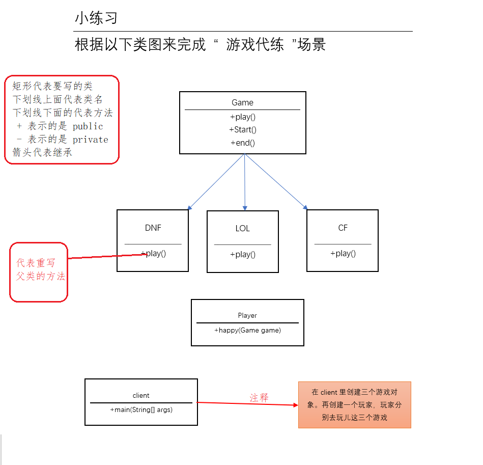

#### 代码

```java
package 面向对象练习_2;

public class Game {
    public void start(){
        System.out.println("正在开机，请稍后");
    }
    public void play(){
        System.out.println("开始玩游戏");
    }
    public void end(){
        System.out.println("关机，早点休息");
    }
}


----------------------------------------------------------------------------------------------------------------------------------------------
    

package 面向对象练习_2;

public class CF extends Game {
    public void CF(){
        System.out.println("打CF，玩生化，换英雄枪");
    }
}

----------------------------------------------------------------------------------------------------------------------------------------------
    

package 面向对象练习_2;

public class DNF extends Game {

    public void play(){
        System.out.println("开始玩DNF，打怪升级");
    }
}


----------------------------------------------------------------------------------------------------------------------------------------------

    
package 面向对象练习_2;

public class LOL extends Game {
    public void play(){
        System.out.println("开始玩LOL");
    }
}


----------------------------------------------------------------------------------------------------------------------------------------------
    
    
package 面向对象练习_2;

public class Player{

    public void happy(Game game){
        game.start();   //一定是父类的方法
        game.play();  //有可能是子类的方法，具体看子类是否有重写父类的方法（就近原则）
        System.out.println("开心");
        game.end();     //一定是父类的方法

        System.out.println(); //回车
    }
}


----------------------------------------------------------------------------------------------------------------------------------------------

    
package 面向对象练习_2;

public class Client {

    public static void main(String[] args) {
        Game game1 = new DNF();  //向上转型
        Game game2 = new LOL();
        Game game3 = new CF();

        Player p = new Player();
        p.happy(game1);
        p.happy(game2);
        p.happy(game3);
    }
}


```


---

---

# 17、final关键字

---

---

### final（最终的）

1. 被final修饰的类不可以被改变。被final修饰的又被称为常量

   ```java
   package Final关键字;
   
   public class Diamond {
       final int weight = 10;  //10克拉的钻石
   
       public static void main(String[] args) {
           Diamond d = new Diamond();
           //d.weight = 5;  //Error:(8, 10) java: 无法为最终变量weight分配值 —— 因为被final修饰了 
       }
   }
   
   ```

   

2.  被 final修饰的方法不可以被重写。

   ```java
    package Final关键字;
   
   public class Diamond {
   
       public final void Sparkling(){
           System.out.println("钻石闪闪发光");
       }
   
       public static void main(String[] args) {
   
       }
   }
   
   ----------------------------------------------------------------------------------------------------------------------------------------------
       
   package Final关键字;
   
   public class Diamond2 extends Diamond{
   
      // public void Sparkling(){ 
           //报错：'Sparkling()' cannot override 'Sparkling()' in 'Final关键字.Diamond'; overridden method is final
       //    System.out.println("钻石闪闪发光");
       // }
   }
   
   ```

3. 被 final修饰的类不能被继承

   ```java
   package Final关键字;
   
   public final class Diamond {
   
   }
   
   ----------------------------------------------------------------------------------------------------------------------------------------------
       
   	package Final关键字;
   //	public class Diamond2 extends Diamond{
   //  	  报错： Cannot inherit from final 'Final关键字.Diamond'
   //	}
   
   ```

   ### 总结

   > ​	final就是不可变
   >
   > ​	final修饰变量	——>	常量
   >
   > ​	final修饰方法	——>	不能被重写
   >
   > ​	final修饰类    	——>     最终类，不能被继承	

 


---

---

# 18、抽象

---

---

> **抽象：现实中不存在的东西（抽疯加想象）**
>
> Java里的抽象 : 只声明，不实现
> 

#### 抽象方法和抽象类
1. 抽象方法：使用 abstract来修饰，不可以有方法体，直接以分号结束

2. 如果一个类中有抽象方法，那么这个类必须是抽象类

   ```java
   package 抽象;
   
   public abstract class Animal {  // 类中只要有抽象方法那么这个类也必须是抽象类
   
       //abstract抽象的 —— 修饰方法，这个方法就是一个抽象方法
           //抽象方法没有方法体，直接以分号结束（因为抽象的意思是想象出来，现实中不存在的）
       public abstract void eat();
   }
    
   ```


#### 特点：
1. 抽象类不可以创建对象

   ```java
   package 抽象;
   public abstract class Animal {
       
       public abstract void eat();
       public abstract void move();
   
   }
   
   ----------------------------------------------------------------------------------------------------------------------------------------------
   
   package 抽象;
   public class Client {
       
       public static void main(String[] args) {
   //        Animal ani = new Animal(); //'Animal' is abstract; cannot be instantiated
           
       }
   }
   
   ```

   

2. 抽象类的子类必须重写父类中的抽象方法，否则子类也必须是抽象类
  ```java
  package 抽象;
  public abstract class Animal {  
      public abstract void eat();
  }
  
  ----------------------------------------------------------------------------------------------------------------------------------------------
  
  package 抽象;
  public class Cat extends Animal{
   public void eat(){
       System.out.println("");
   }
  }
  ```

##### 通过抽象类可以强制的要求子类中必须有哪些方法

```java
package 抽象;

public abstract class Animal {
    
    public abstract void eat();
    public abstract void move();
    
}

----------------------------------------------------------------------------------------------------------------------------------------------
    
package 抽象;
public class Cat extends Animal{
    
    public void eat(){
    }
    public void move(){
    }
    
}

```

### 小知识点：

> 抽象类中可以有正常的方法
```java
package 抽象;

public abstract class Animal {

    public abstract void eat();
    public abstract void move();

    //抽象类中可以有正常的方法
    public void run(){
        
    }
    
}
```


---
---
# 19、接口
---
---
### 什么是接口

1. 接口实际上是一种特殊的抽象类

2. 接口中的所有方法都是抽象类

3. 接口使用 interface来声明

   ```java
   package 接口;
   
   /*
   *   能继承接口的只能是接口。（猴子生出来的只能是猴子不可能是孙悟空）
   *   接口和类只能是实现关系 implements
   *
   * */
   
   public interface Valuable { //接口使用 interface 来声明，不属于class (类)
   
       //接口中所有的方法都是抽象方法，可以省略 abstract
       //接口中所有的内容都默认是 public
       public void getMoney();
   }
   
   ----------------------------------------------------------------------------------------------------------------------------------------
       
   package 接口;
   
   //public class Gold extends Valuable{}  //Class 'Gold' must either be declared abstract or implement abstract method 'getMoney()' in 'Valuable'
   public class Gold implements Valuable{
   
       //必须实现(重写)抽象方法
       public void getMoney(){
           System.out.println("黄金可以换钱");
       }
   }
   
   ----------------------------------------------------------------------------------------------------------------------------------------
       
   package 接口;
   
   public class Main {
       public static void main(String[] args) {
           //Gold g = new Gold();
           Valuable g = new Gold();    //接口一样也具有多态性
           g.getMoney();
       }
   }
   ```

   

######  类只能单继承。Java里接口支持多实现。

###### 	接口同样具有多态性

```java
package 接口;

public interface Protectable {
    public void Protected();
}


----------------------------------------------------------------------------------------------------------------------------------------------
    
package 接口;

//Java中类可以继承一个类，但可以实现多个接口
public class Panda extends Animal implements Valuable, Protectable{

    @Override //重写。 表示这个方法是重写的
    public void eat() {
        System.out.println("熊猫吃竹子");
    }

    @Override
    public void Protected() {
        System.out.println("熊猫集中在四川保护区里");
    }

    @Override
    public void getMoney() {
        System.out.println("熊猫是保护动物，熊猫很值钱");
    }
}

----------------------------------------------------------------------------------------------------------------------------------------------
    
package 接口;

public interface Valuable { 
    public void getMoney();
}

----------------------------------------------------------------------------------------------------------------------------------------------
    
package 接口;

public class Animal {
    public void eat(){
        System.out.println("肚子饿了吃东西");
    }

}

----------------------------------------------------------------------------------------------------------------------------------------------
    
package 接口;

public class Main {
    public static void main(String[] args) {
        
		//接口一样也具有多态性
        Panda p = new Panda();
        Animal ani = new Panda();  //向上转型
        Valuable v = new Panda();  //向上转型
        Protectable pro = new Panda();  //向上转型

        //p.eat();
        //p.getMoney();
        //p.Protected();

        ani.eat();
        //ani.Protected();    //报错：因为站在动物的角度只能吃rsd
        //ani.getMoney();   //也不行

        v.getMoney();
        pro.Protected();
    }
}

```

###### 接口可以把很多不相关的东西进行整合

### 接口特点

1. 接口中所有的方法都是抽象方法。都是公开的

2. 接口中的所有变量都是全局静态常量 

   ```java
   package 接口;
   public interface Valuable {
       int money = 100;  //前面隐含了 public static final
   }
   
   -----------------------------------------------------------------------------------------------------------------------------------------
       
   package 接口;
   
   public class Main {
       public static void main(String[] args) {
           //Valuable.money = 10;    //无法为最终变量money分配值
           System.out.println(Valuable.money);		//打印出100
       }
   }
   
   ```

   


---

---

# 20、面向对象练习_3接口

---

---

### 小练习

现在有两种数据库，一个是MySQL数据库，另一个是Oracle数据库。请通过程序设计，设计一个可以根据用户输入来自动选择数据库，		并执行增删查改操作。

```
需求：
	在 main里，根据用户输入的编号，系统自动创建一个MysqlDao或者OracleDao，然后执行增删查改操作。
```

类图地址：https://www.processon.com/view/link/5c92012fe4b01e76978642b1   

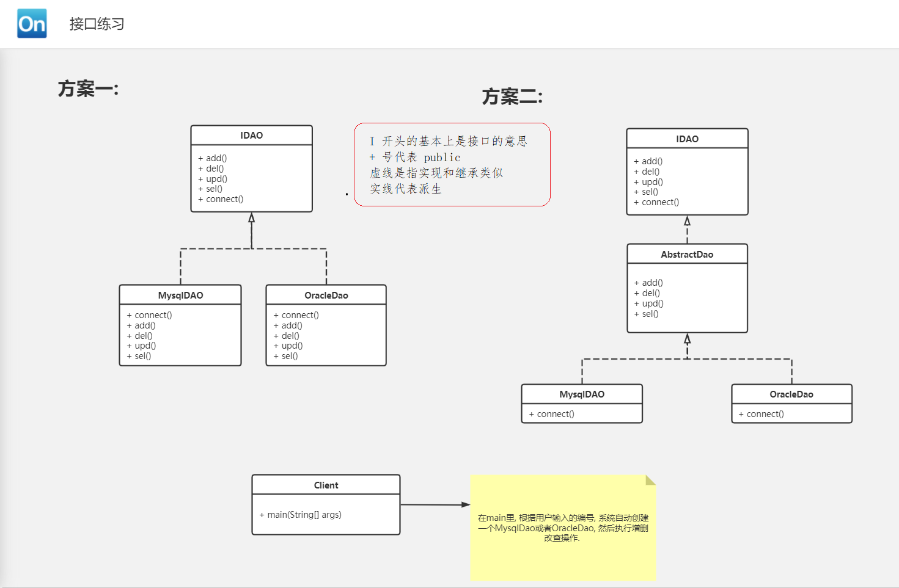

```java
package 面向对象练习_3接口;

public interface IDAO {
    void connect();
    void add();
    void del();
    void sel();
    void upd();
}

----------------------------------------------------------------------------------------------------------------------------------------------
    
package 面向对象练习_3接口;

public abstract class AbstractDao implements IDAO{
    //隐藏了一个抽象方法 —— void connect();

    @Override
    public void add() {
        System.out.println("新增");
    }

    @Override
    public void del() {
        System.out.println("删除");
    }

    @Override
    public void sel() {
        System.out.println("查找");
    }

    @Override
    public void upd() {
        System.out.println("更新");
    }
}

----------------------------------------------------------------------------------------------------------------------------------------------
    
package 面向对象练习_3接口;

public class MysqlDao extends AbstractDao{
    @Override
    public void connect() {
        System.out.println("MySQL连接成功");
    }
}

----------------------------------------------------------------------------------------------------------------------------------------------
    
package 面向对象练习_3接口;

public class OracleDao extends AbstractDao{
    @Override
    public void connect() {
        System.out.println("Oracle连接成功");
    }
}

----------------------------------------------------------------------------------------------------------------------------------------------
    
package 面向对象练习_3接口;

import java.util.Scanner;

public class Main {
    public static void main(String[] args) {
        System.out.println("请问你要连接的数据库是: 2、Oracle  1、Mysql");

        Scanner in = new Scanner(System.in);
        int n = in.nextInt();
        
        IDAO dao; //在外面声明变量
        if(n==1){
            System.out.println("正在连接Myql……");
             dao = new MysqlDao();
        } else {
            System.out.println("正在连接Oracle……");
             dao = new OracleDao();
        }
        
        dao.connect();
        dao.add();
        dao.del();
        dao.sel();
        dao.upd();
    }
}
```


---

---

# 21、成员变量初始值

---


### Java中所有的变量必须先声明，后赋值才能使用

```java
class Main{
    public static void main(String[] args) {
        int n;
        System.out.println(n);	//Error:可能尚未初始化变量n
    }
}
```

### Java中的成员变量，在创建对象的时候，都会执行一次初始化操作，都会给一个默认值

> 1. 基本数据类型的默认值是0，包括boolean ——>false（false在计算机中是0，1是true）
> 2. 引用数据类型默认值是	null
>    - null表示空，什么都没有，仅仅只是用来占位

```java
package 成员变量初始值;

public class Child {

}

----------------------------------------------------------------------------------------------------------------------------------------------
    
package 成员变量初始值;

public class Person {
    //int age;

    byte b;
    short s;
    int i;
    long l;
    float f;
    double d;
    char c;
    boolean  bool;

    String str; //String是Java提供的一个类
    Child child;    //自己写的类

}

----------------------------------------------------------------------------------------------------------------------------------------------

package 成员变量初始值;

public class Main {
    public static void main(String[] args) {
        Person p = new Person();
        System.out.println("byte"+p.b);
        System.out.println("short"+p.s);
        System.out.println("int"+p.i);
        System.out.println("long"+p.l);
        System.out.println("float"+p.f);
        System.out.println("double"+p.d);
        System.out.println("char"+(int)p.c);
        System.out.println("Boolean"+p.bool);

        System.out.println("String"+p.str);
        System.out.println("Child"+p.child);
    }
}


----------------------------------------------------------------------------------------------------------------------------------------------
    
/*
	输出内容：
            byte 0
            short 0
            int 0
            long 0
            float 0.0
            double 0.0
            char 0
            Boolean false
            String null
            Child null
            
*/
```


---

---

# 22、object

---


> **万物皆对象**

### 在Java中所有的类都要继承 object


1.  **object是一个类，所有类的根** 

   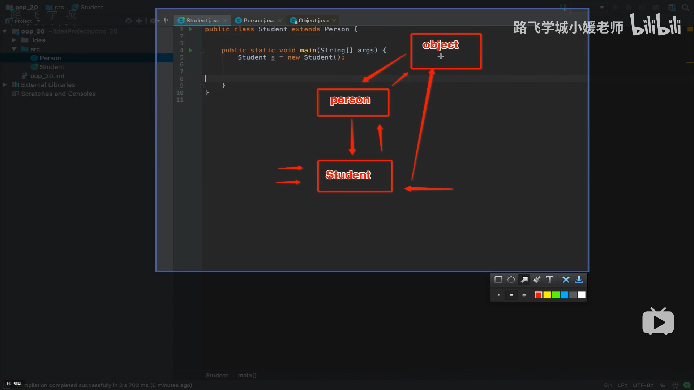


2. **我们写的类即使不写继承关系，那么默认也是会继承object**

   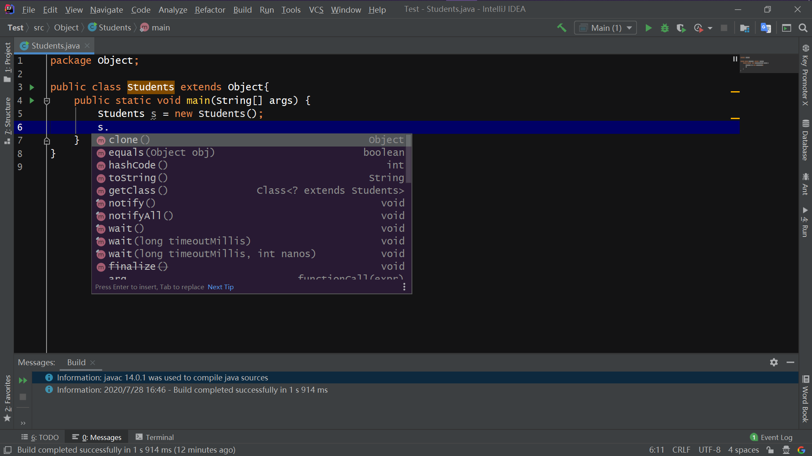


---

---

# 23、equals 和 ==

---

> 
>
> == 是判断左右两端是否相等
>
> equals：object类提供的一个方法 —— 是用来判断两个对象是否相等
>
> 

##### equals自己可以重写

```java
package equals和两个等号的区别;

public class Cat {
    String name;
    String color;

    public Cat(String name, String color){
        this.name = name;
        this.color = color;
    }

    public Boolean equals (Cat c){
        if(this.color == c.color){  //单纯自己写判断语句
            return true;
        } else {
            return false;
        }
    }

    public static void main(String[] args) {
        Cat c1 = new Cat("小花", "white");    //第一只猫
        Cat c2 = new Cat("小花", "white");    //第二只猫

    /*
        System.out.println(c1 == c2);  //false
                // 双等判断的是两个对象的内存地址是否一致。一般用在基本数据类型上
        System.out.println(c1.equals(c2));  //false
                // 默认调用object提供的equals方法

     */
        System.out.println(c1.equals(c2));  //运行结果是true。此时调用的是子类里重写后的equals方法

    }
}

```


##### 字符串的判断必须用equals	可以帮我们判断内容

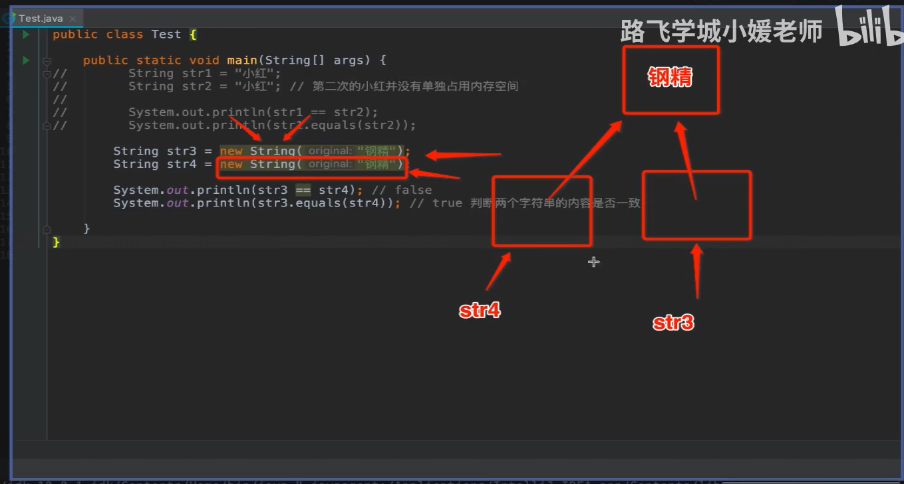

```java
package equals和两个等号的区别;

public class Main {

    public static void main(String[] args) {
        String str1 = "小红";  //true
        String str2 = "小红";  //true //第二个的小红并没有单独占用内存空间
        System.out.println(str1 == str2);
        System.out.println(str1.equals(str2));

        String str3 = new String("小白");
        String str4 = new String("小白");
        System.out.println(str3 == str4);   //false    //判断的是地址
        System.out.println(str3.equals(str4));  //true  //判断两个字符串的内容是否一致
    }
}

```


### 总结

> 
>
> 字符串的判断必须要用equals来判断
>
> 


#### 小练习：模拟用户登录

```java
package equals和两个等号的区别;

import java.util.Scanner;

public class 小练习 {

    public static void main(String[] args) {
        String username = "admin";
        String password = "123";

        Scanner in = new Scanner(System.in);

        System.out.println("请输入用户名：");
        String uname = in.nextLine();

        System.out.println("请输入密码：");
        String upwd = in.nextLine();

        //判断用户名和密码是否一致 —— equals来判断
        if (uname.equals(username) && upwd.equals(password)){
            System.out.println("登录成功");
        } else {
            System.out.println("登录失败");
        }

    }
}
```


---

---

# 24、toString

---


```java
package toString;

public class Cat {  //类默认会自动继承 Object
    String name;
    String color;

    public Cat(String name, String color) {
        this.name = name;
        this.color = color;
    }

    //子类对父类的方法不满意 —— 重写

    public static void main(String[] args) {
        Cat c = new Cat("小红", "白色");

        //直接打印这只猫
        System.out.println(c);
        //默认打印对象，会自动执行这个对象的toString()的方法
                //System.out.println(c.toString());
        //默认的toString() ——> 包名.类@内存地址

    }
}
```


### 对比

```java
package toString;

public class Cat {  //类默认会自动继承 Object
    String name;
    String color;

    public Cat(String name, String color) {
        this.name = name;
        this.color = color;
    }

    //子类对父类的方法不满意 —— 重写


    @Override
    public String toString() {
        return "Cat{" +
                "name='" + name + '\'' +
                ", color='" + color + '\'' +
                '}';
    }

    public static void main(String[] args) {
        Cat c = new Cat("小红", "白色");

        //直接打印这只猫
        System.out.println(c);
        //默认打印对象，会自动执行这个对象的toString()的方法
                //System.out.println(c.toString());
        //默认的toString() ——> 包名.类@内存地址

    }
}


/*
输出内容：
		Cat{name='小红', color='白色'}
*/
```

#### toString对一个对象的字符串的表现形式  

> 
>
> Java官方推荐重写这个方法，因为默认的的太丑了 —— 包名.类@内存地址
>
> 


---

---

# 25、instanceof关键字

---

#### 		instanceof : 判断xxx对象是否是xxx类型的

```java
package instanceof关键字;

public class Animal {

}

----------------------------------------------------------------------------------------------------------------------------------------------

package instanceof关键字;

public class Cat extends Animal{

    public static void main(String[] args) {
        Animal ani = new Cat();

        if (ani instanceof Cat) {   //判断ani是否是一只猫
            System.out.println("这只动物是一只猫");
        } else {
            System.out.println("这只动物不是一只猫");
        }

    }
}

```


---

---

# 26、内存分析

---


#### 1、堆 —— 主要用来存放对象

#### 2、栈 —— 局部变量，以及基本数据类型的变量

#### 3、代码区 —— 类和方法

#### 4、数据区 —— 常量池和静态变量


```java
package 内存分析;

public class Person {
    private String name;
    private int age;
    private String address;

    public static int num = 0;

    public Person (String name, int age, String address) {
        this.name = name;
        this.age = age;
        this.address = address;

        num++;
    }

    public static void main(String[] args) {
        int a = 10;
        Person p1 = new Person("少林寺", 18, "河南嵩山");
        Person p2 = new Person("吐鲁番",12,"新疆");
        Person p3 = new Person("海口",21,"海南岛");
        Person p4 = new Person("北戴河",11,"河北");

        System.out.println(Person.num);
    }

}
```


###  内存分析图

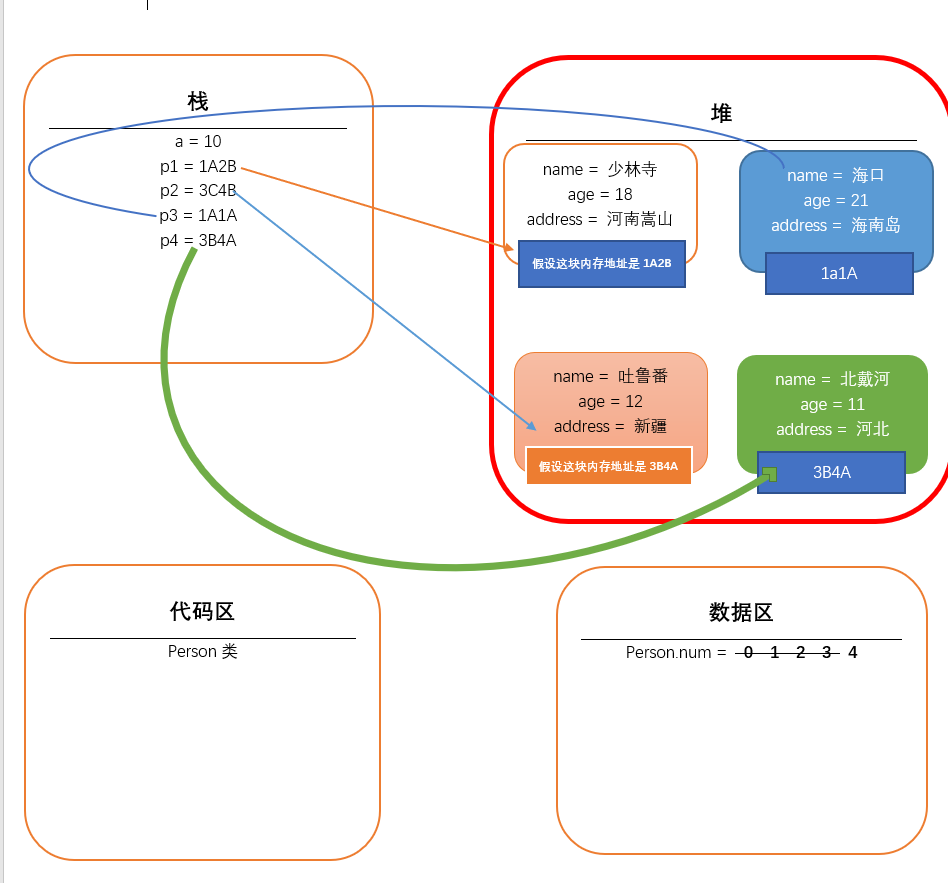


---

---

# 27、参数传递的问题

---


#### 值传递：把变量的值作为参数进行传递

```java
package 参数传递的问题;

public class Main {
    public static void change(int b){
        b = 20;
    }

    public static void main(String[] args) {
        int a = 10;
        change(a);
        System.out.println(a);
    }
}
 
```


#### 引用传递：直接把变量作为参数进行传递


### Java使用的是值传递


```java
package 参数传递的问题;

public class Cat {
    String name;

    public Cat(String name) {
        this.name = name;
    }
}

----------------------------------------------------------------------------------------------------------------------------------------------

package 参数传递的问题;

public class Main {

    public static void change(Cat c) {
//         c = new Cat("虹猫");  //输出蓝猫
        c.name = ("虹猫");  //输出虹猫
    }

    public static void main(String[] args) {
        Cat c = new Cat("蓝猫");
        change(c);
        System.out.println(c.name);
    }
}

```


---

---

# 28、面向对象总结

---


### 面向对象重点：

1. **类与对象 ——> 封装**
2. **构造**
3. **访问权限**
4. **继承**
5. **多态【重中之重】**
6. **抽象**
7. **接口**
8. **内存简单分析**


---

---

# ————————————

---


---

---

# 1、异常处理简介

---

> 
>
> 三百六十行，行行出异常
>
> 


#### 异常就是错误对象

- **编译时异常 ：大概是语法错误**
- **运行时异常 ：大概时语义错误**

#### 抛异常

- **创建一个错误对象，把错误对象丢出来**

#### 捕获异常

-  **JVM 捕获被扔出来的抛异常，并打印出来**
-  **JVM会终止程序的执行。所以后续不能让 JVM 来进行捕获异常**


---

---

# 2、异常的分类

---


1. **RuntimeException ：运行时异常（一般程序员很少去手动处理，因为太多。出问题后才会去处理）——  好多的小石子**
2. **其他Exception ： 必须要手动处理，不然编译不通过  ——  大石头**
3. **Error ： 一般指的是系统级错误 ，一般普通程序员搞不定，一般不处理 —— 山塌了 **


#### 异常家族体系


---

---

# 3、 异常处理 —— try ……catch

---


### 语法：

```java
try{
	尝试执行的代码 ;
} catch( Exception e ) {  // 变量 Exception e —— 用来捕获抛出来的异常（抛异常）
    处理异常的代码 ; 
} finally {
    最终的代码 ; 
}
```

```java
package 异常处理;

public class Test {
    public static void main(String[] args) {
        try{
            System.out.println(1/0);  //0不能做除数
            //System.out.println(1/1);
        } catch(Exception e){
            e.printStackTrace();    //打印错误信息
            System.out.println("系统出错了，请联系管理员"); //一般是给客户看的
        } finally{  //一般做收尾工作
            System.out.println("你好，我是finally");
        }

    }
}

```


---

---

# 4、异常处理 —— throws和throw

---


### throws : 表示方法准备向外扔出异常 

```java
package 异常处理_throws和throw;

import java.io.File;
import java.io.FileInputStream;
import java.io.InputStream;

public class Test {
    public static void read() throws Exception{  //表示这个方法会抛出去Exception这样的错误，产生的任何问题都扔出去

            InputStream is = new FileInputStream(new File("hahahaha"));  //读取文件要准备的流

    }

    public static void main(String[] args) throws Exception {
        //或者
//        try {
//            read();
//        } catch (Exception e) {
//            e.printStackTrace();
//        }

        read();
    }
}

```

### throw ：表示向外抛出异常

```java
package 异常处理_throws和throw;

import java.io.File;
import java.io.FileInputStream;
import java.io.InputStream;

public class Test {

    public static void chu(int a, int b) throws Exception{  //告诉外面我要扔出错误
        if (b==0){
            throw new Exception("你不可以给我一个0");   //这是真正的向外抛出异常
        } else {
            System.out.println(a/b);
        }
    }

    public static void main(String[] args){
        try {
            chu(2,1);  // IDEA 里 alt+enter选择处理异常的方式
        } catch (Exception e) {
            e.printStackTrace();
        }
    }
}

```


###### 产生的错误尽量自己处理，少向外抛出异常


---

---

# 5、自定义异常

---


###### 直接继承 Exception 或者是RuntimeException 来实现自定义异常

```java
package 自定义异常;

public class Person {
    String name;
    String gender;

    public Person(String name, String gender){
        this.name = name;
        this.gender = gender;
    }
}

-------------------------------------------------------------------------------------------------------------------
    
package 自定义异常;

public class Bathhouse {

    public void man(Person p) throws GenderException{
        if(p.gender.equals("男")){
            System.out.println("洗个痛快澡");
        } else {    //来了个女的
            //需要抛出异常
            throw new GenderException("你进错了，这里是男澡堂子。");
        }
    }
}

-------------------------------------------------------------------------------------------------------------------
    
package 自定义异常;

public class GenderException extends Exception{
    //自己定义的异常必须要继承 Exception（必须处理） 或者是 RuntimeException（看心情处理）

    public GenderException(String m){
        super(m);//调用父类的构造方法。Exception(m)
    }

}

-------------------------------------------------------------------------------------------------------------------
    
package 自定义异常;

public class Main {

    public static void main(String[] args) throws GenderException{
        Person p1 = new Person("张无忌", "男");

        Person p2 = new Person("赵敏", "女");

        Bathhouse bh = new Bathhouse();

        bh.man(p1);
    }

}

```